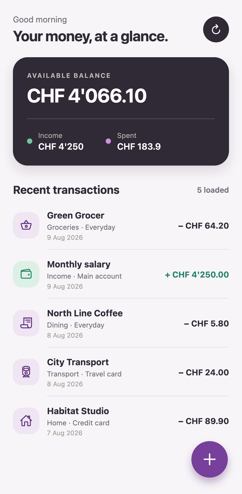

# Spending Tracker

> [!IMPORTANT]
> **This entire repository, including the application, design, tests, documentation, and deployment setup was made with AI.**

A calm, mobile-first Expo application for reviewing daily spending and quickly capturing new expenses through Spending Tracker Server.

## Screenshot



## Features

- A scannable home screen backed by the server API with balance, income, spending, and all recent transactions.
- A prominent floating add button opens a native-style bottom drawer.
- Transaction and split-transaction modes.
- Server-provided account, category, and tag selections with validated normal and split submissions.
- Server-managed category icons and colors throughout the picker and transaction list.
- Bottom-tab navigation for Transactions, Wallets, Receipts, and Settings.
- Native receipt camera capture, background upload and processing status, with extracted values prefilled into the transaction drawer.
- Persistent default-account selection that prefills new transactions on the current device.
- Persistent failed-transaction queue with visible server errors and individual retry actions.
- Responsive Expo app for Android, iOS, and web.

## Development

```sh
cp .env.example .env
npm ci
npm start
```

Set `EXPO_PUBLIC_SPENDING_TRACKER_API_URL` to the Spending Tracker Server origin reachable from the device. Physical devices cannot use the development computer's `localhost`; use its LAN address or a deployed HTTPS endpoint. Set `EXPO_PUBLIC_SPENDING_TRACKER_API_KEY` when the server requires bearer authentication. Like every Expo public variable, this value is embedded in the client, so use a dedicated mobile API key and rotate it when needed.

Run the full local verification suite:

```sh
npm run format:check
npm run lint
npm run typecheck
npm run build
npm test
npm run test:e2e
```

## Pipeline

The Gitea pipeline runs formatting, lint, and type checks first, builds the Expo web application once, then runs unit and browser tests in parallel. Successful main-branch and tag builds publish a small nginx container image. The browser-test container is pinned to the same Playwright version as the project. Configure `CONTAINER_REGISTRY`, `EXPO_PUBLIC_SPENDING_TRACKER_API_URL`, and `EXPO_PUBLIC_SPENDING_TRACKER_API_KEY` as Gitea variables and `REGISTRY_USERNAME` plus `REGISTRY_PASSWORD` as secrets; no npm cache is used. Expo public variables are embedded in the application bundle and must not be treated as confidential.

## License

Spending Tracker is available under the [MIT License](LICENSE).
